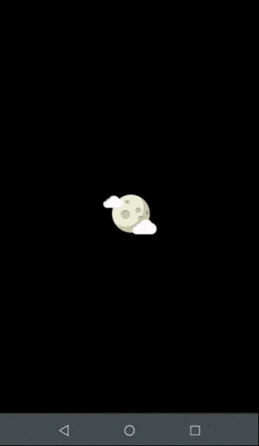

# Moonphase Android App

The Moonphase Android App is a mobile application developed with Jetpack Compose and Kotlin. It provides users accurate information about moon phases. The app consumes data from the [Moonphases Crawler](), a reliable web scraping tool that collects data on date, moon phase, illumination, and moon phase change time.


## Demo



## Lessons Learned

During the development of the Moonphase Android App, several valuable lessons were learned:

- Jetpack Compose

  Jetpack Compose simplify the process of creating and developing, allowing me to implement a declarative and reactive user interfaces. With Jetpack Compose, I achieved an efficient and intuitive development experience.

- Notifications

  Implementing notifications in the app enhanced the user experience by providing alerts about moon phase events. I utilized the Notification API provided by Android to create custom notifications and handle user interactions.

- SharedPreferences

  To store app information, I utilized SharedPreferences. SharedPreferences is a lightweight data storage mechanism in Android that allows for storing and retrieving simple key-value pairs.

- JSON resources

  Working with JSON resources allowed me to handling data retrieved from the Moonphases Crawler. I used the Gson library to deserialize JSON data into Kotlin objects, allowing me to extract and display the necessary moon phase information in the app.

- Material3

  The app utilizes Material Design principles and follows the latest Material3 guidelines to provide a modern user interface. I implemented Material Design components, typography and color schemes.


## Getting Started

1. Clone the project

    ```bash
    git clone https://link-to-project
    ```

1. Open the project in Android Studio.

1. Build and run the app on your Android device or emulator.
